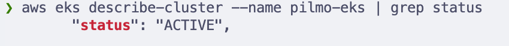
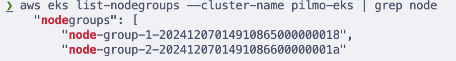
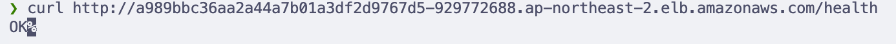
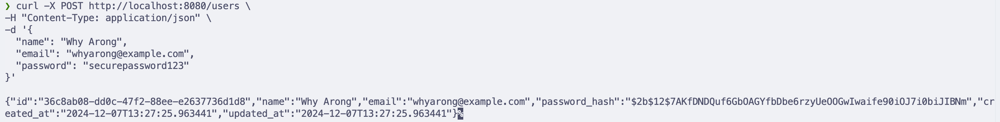
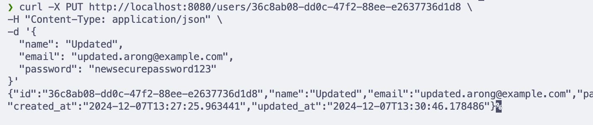
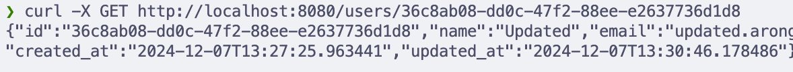
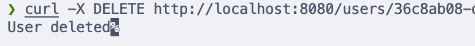
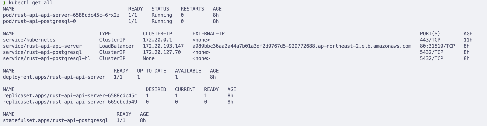
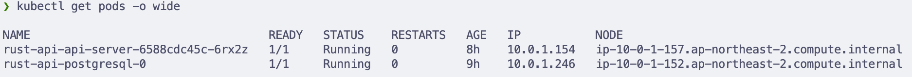
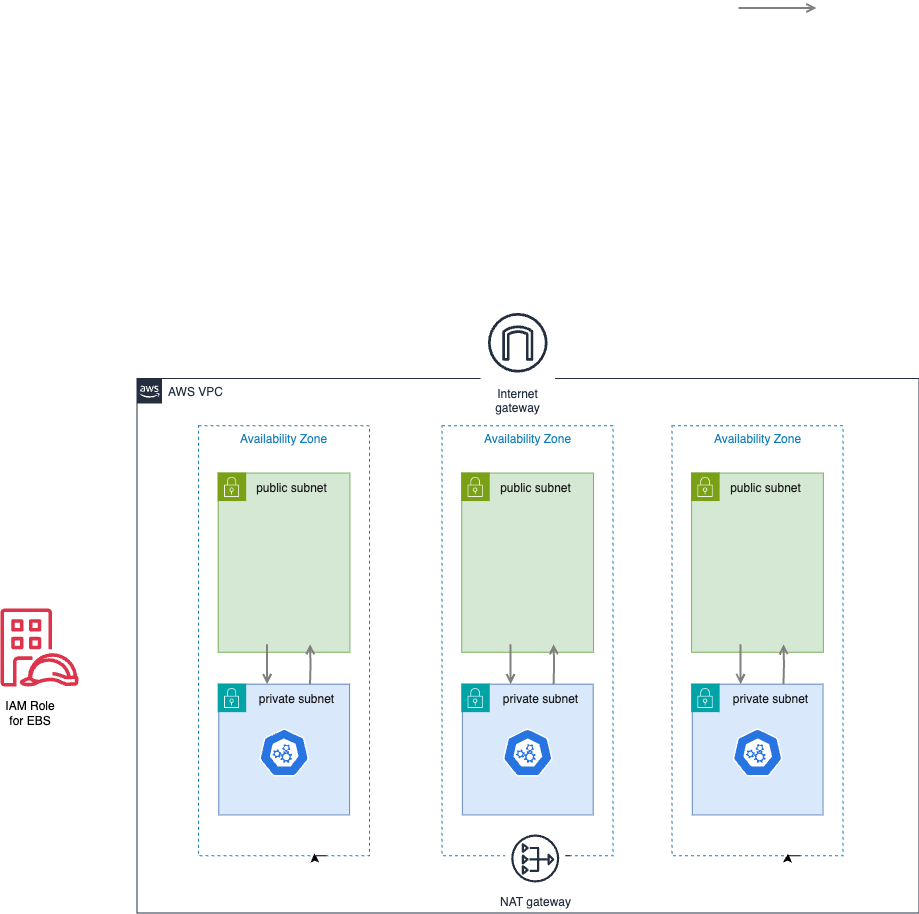

## Deploying Helm Charts in Kubernetes with Terraform

이 프로젝트는 `Terraform`을 사용하여 `AWS EKS` 클러스터를 자동으로 구성하고, `Kubernetes`에서 **Rust**로 작성된 API 서버와 PostgreSQL 데이터베이스를 `Helm Chart`로 배포합니다.

API 서버에 대한 정보는 아래의 repo를 참고해주세요.
##### https://github.com/why-arong/api-server


#### 목표
- **자동화**: `Terraform`으로 EKS 클러스터 및 네트워크를 자동화하여 클라우드 인프라 관리의 복잡성을 줄임.
- **리소스 분리**: 애플리케이션 서버와 데이터베이스를 각기 다른 노드 그룹에 배치.
- **배포 표준화**: `Helm Chart`를 통해 애플리케이션 배포를 재사용 가능한 방식으로 관리.

----------
----
이 레포지토리는 두 개의 주요 폴더로 구성되어 있습니다.

1. **`tf-infra`** - EKS 클러스터 구성을 위한 인프라 설정 파일을 포함합니다.
2. **`api-server`** - 애플리케이션 배포를 위한 파일을 포함합니다.


### 1. EKS 클러스터 구성
`Terraform`을 사용하여 AWS EKS 클러스터와 관련 리소스를 설정합니다.

**Terraform 주요 설정**
- **클러스터 생성**:
    - Kubernetes version: v1.29.

- **VPC 네트워크**:
    - 퍼블릭 및 프라이빗 서브넷 구성.
    - NAT 게이트웨이 및 Internet Gateway 설정.

- **IAM 역할**:
    - EKS 클러스터 및 노드 그룹을 위한 권한 관리.

**노드 그룹 구성**
- **API 서버용 노드 그룹:**
    - 인스턴스 타입: `t3.micro`
    - 최소 1대에서 최대 3대까지 Auto Scaling.
    - Rust API 서버를 배치하여 요청을 처리.
- **데이터베이스용 노드 그룹:**
    - 인스턴스 타입: `t3.small`
    - 최소 1대에서 최대 2대까지 Auto Scaling.
    - PostgreSQL 배치로 데이터베이스 워크로드 처리.
- **리소스 격리:**
    - 각 노드 그룹은 Kubernetes의 nodeSelector 설정으로 애플리케이션과 데이터베이스를 분리.


**Terraform 실행**
1. AWS 인증

이 프로젝트에서 저는 HCP(HashiCorp Cloud Platform)의 AWS 계정의 환경변수를 저장 기능을 이용했습니다.
https://app.terraform.io/app
(terraform state도 이곳에 저장됩니다.)

하지만, AWS CLI 를 이용하고자 한다면 아래의 명령어를 이용하면 됩니다.

```
aws configure
```
    
2. Terraform 실행:

```bash
terraform init
terraform apply -auto-approve
```
####  테스트
- EKS 클러스터가 정상적으로 생성되었는 지 확인

- EKS 노드 그룹이 정상적으로 생성되었는지 확인

### 2. 애플리케이션 배포
**Helm Chart 구성**
- **Rust API 서버:**
    -  `LoadBalancer` 서비스를 통해 외부 트래픽 허용.
- **PostgreSQL 데이터베이스:**
    - `StatefulSet`으로 데이터 영속성 보장.
    - `ClusterIP` 서비스를 통해 내부 통신 처리.

**Helm Chart 배포**
- Helm Chart 초기화:

```bash
helm repo add bitnami https://charts.bitnami.com/bitnami
helm dependency update
```
postgresql 배포를 위해 **Bitnami Helm Chart**를 사용했습니다.

- Rust API 서버 배포;
```bash
helm upgrade --install rust-api . --values values.yaml
```
#### 테스트
#### API 서버 Health Check 


####  API 서버 CRUD
1. 사용자 생성


2.사용자 정보 수정


3. 특정 사용자 조회


4.사용자 삭제


##### 클러스터 리소스 상태 확인

##### 리소스 분리 확인



### 인프라 구성도

